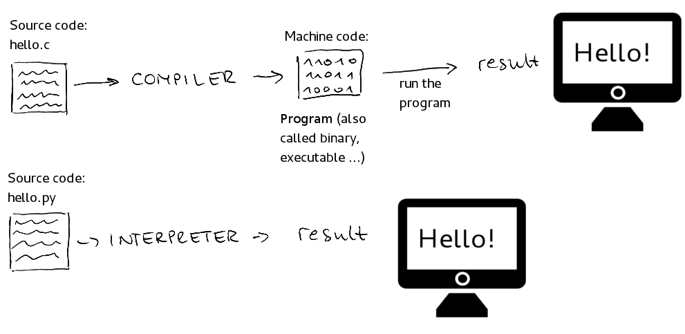
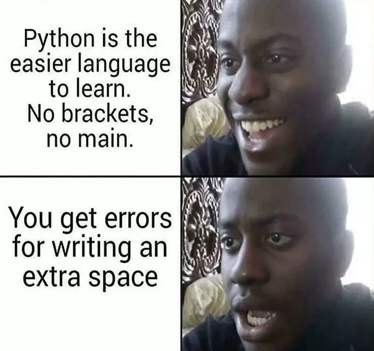
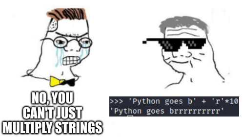
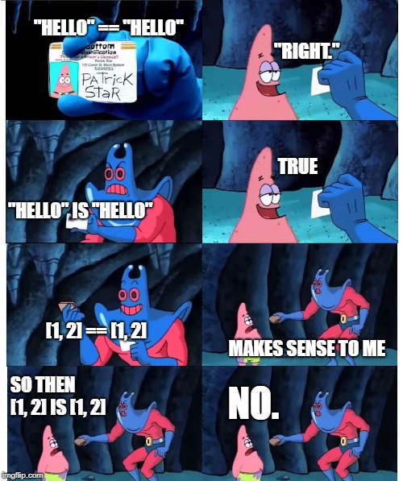
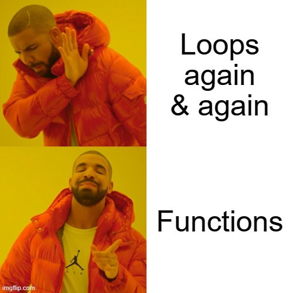
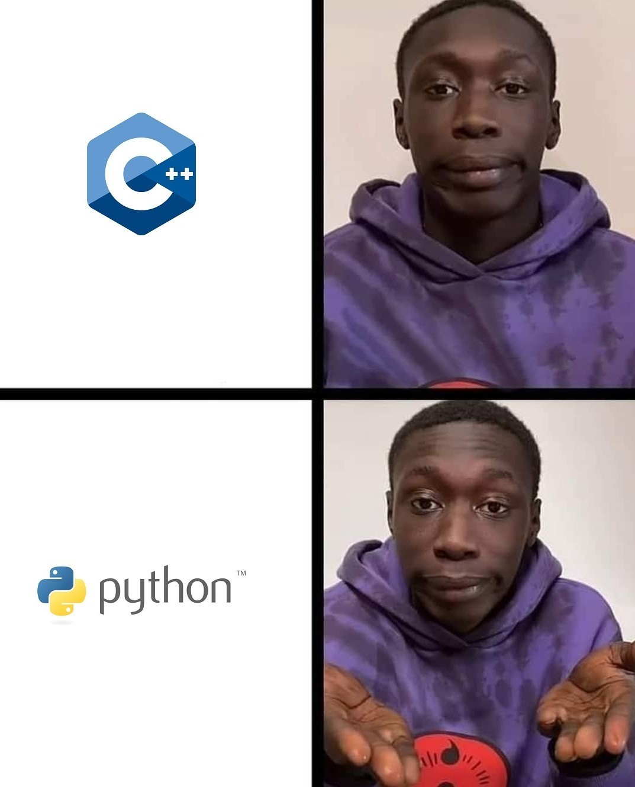
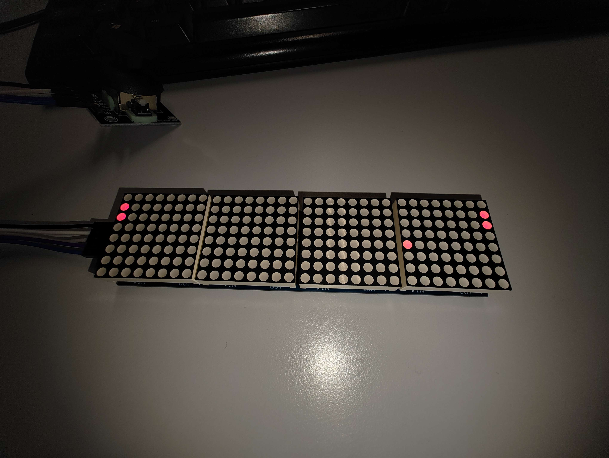

class: center, middle, inverse, small-images

# Python: Primeiros passos


---
class: inverse

# Temas

1. Introdução à programação
2. Referências para programar em python
3. "Olá Mundo!"
4. Variáveis
5. Operações com listas
6. Operações aritméticas
7. Condições
8. Ciclos
9. Funções
10. Instruções do workshop
---
class: extra-images

# Introdução à programação
De modo a criar qualquer programa em computador, utiliza-se normalmente uma **linguagem de alto nível** à nossa escolha (p.ex: Java, C++, Python), a qual será depois traduzida para algo que o computador consiga executar.


---
Existem dois tipos de linguagens:

**Linguagens Compiladas** - Linguagem que, após compilada, gera machine code (código-máquina) - C++, C, C#...

**Linguagens Interpretadas** - Linguagens em que o código, ao invés de ser compilado, é lido e executado por um programa - Python, JavaScript, BASIC...
<br/><br/><br/>



---
class: small-images, image-spaced

# Referências para programar em python
- GDB: https://www.onlinegdb.com/
- Python 3.10 (Shell): https://www.python.org/downloads/release/python-3100/
- **VS Code**: https://code.visualstudio.com/
- **Pycharm**: https://www.jetbrains.com/pycharm/
- **Spyder/Anaconda**: https://www.anaconda.com/

---
class: medium-images, center, middle


---


# "Olá Mundo!"
O programa "Hello World" é o típico primeiro programa que todos os iniciantes fazem numa qualquer nova linguagem de programação; em Python, este programa destaca-se pela sua simplicidade (o mesmo programa em Java abaixo, **apenas** para efeitos de comparação):

```python
# O teu primeiro programa em Python! :D
print("Hello World!")
```
```Java
// Se possível, não toquem em Java :,D
class HelloWorld {
    public static void main(String[] args) {
        System.out.println("Hello World!");
    }
}
```

---
class: center, middle, inverse
# Variáveis

---
# Variáveis

De modo a simplicar a visão de uma variável pode-se equipará-la a uma caixa à qual é atribuída um valor, ou seja, o conteúdo que se encontra dentro da caixa.


---

# Variáveis

Há 6 tipos de variáveis nativos de python (i.e, não necessitamos de ferramentas adicionais para trabalhar com as mesmas):
- Números (ints e floats) (ex: **4** e **3.14159**, respetivamente)
- Booleanos (Verdadeiro ou Falso) (ex: **True** e **False**, respetivamente)
- Strings (Cadeias de caracteres) (ex: **"O curso é bom (juro)"**) <-- **Não mutáveis!!**
- Listas (ex: **["a", -3, True]**)
- Dicionários (ex: **{"jogo": "Undertale", "score": 9}**)
- Tuplos (ex: **(2,3)**) <-- **Não mutáveis!!**

```python
var = 2         # variável com um valor inteiro
var1 = "spe"    # variável com uma string associada
var = var1
print(var)      # o resultado será "spe" visto que não há erro (em Python!) em associar
                # novamente uma variável com um tipo de valor diferente do inicial
```

---
# Operações com listas

Ao contrário de variáveis como tuplos e strings, podem-se mudar os valores de uma lista, sejam eles quais foram. Um exemplo disso seria:

```python
list1 = [1,2,3,4]
list1[2] = 5    # Altera o 3º elemento de list1 de 3 para 5
list1[0] = 2    # Qual é o valor que é mudado?
list1[-1] = 9   # Altera o último valor de list1

```

Para além disto, também temos diversos outros métodos que mexem com listas:
- **.append(x)** - adiciona um valor ao final da lista
- **.insert(x, y)** - insere o valor **y** no índice **x**
- **.remove(x)** - remove a primeira ocorrência de **x** na lista
- **.pop(y)** - remove o elemento da lista no índice **y** e retorna esse valor

---
class: center, middle, inverse
# Operações aritméticas

---
class: medium-images
# Operações aritméticas
Em python, existem 7 principais operações numéricas que se podem realizar:

- **+** (soma)
- **-** (subtração)
- **\*** (multiplicação)
- **/** (divisão)
- **\*\*** (expoente)
- **//** (divisão inteira)
- **%** (resto)

```python
print(3*2)      # 6
print(1/2)      # 0.5
print(4%3)      # 1
print(4**2)     # 16
print(5//2)     # 2, pois arredonda para baixo

```
---
class: center, middle



---
class: center, middle, inverse
# Condições

---
# Condições

De modo a estabelecer comportamentos específicos do programa quando o mesmo cumpre certos requisitos, utiliza-se os **if** **else** *statements*.
- **"if"**: se a condição proposta for verdadeira, executa o código deste bloco
- **"elif"**: ("else" + "if") se a(s) condição/condições proposta(s) anteriormente forem falsas e esta verdadeira, executa o código deste bloco
- **"else"**: caso nenhuma das condições anteriores seja verdade, executa este bloco

Para criar as condições usadas nestes blocos de código, podem-se usar alguns dos seguintes **operadores lógicos:**
- **">"** e **">="** (**maior que** e **maior ou igual a**)
- **"<"** e **"<="** (**menor que** e **menor ou igual a**)
- **"!="** e **"=="** (**diferente de** e **igual a**)
- **"and"** e **"or"** (**logic AND** e **logic OR**)
- **"not"** (**logic NOT**)

---
# Condições

```python
num = 2

if(num <= 1):                               # verificará se o valor da variável num
    print("It is 1 or less!")               # é inferior ou igual a 1

elif(num == 0):                             # verificará se o valor da variável num
    print("It has the value of 0")          # é igual a 0

else:                                       # executará este print, pois não conseguiu
    print("Idk what this is my friend :(")  # encontrar nenhuma condição
                                            # que fosse satisfeita


```

---
class: center, middle




---
class: center, middle, inverse
# Ciclos
---

# Ciclos
Sempre que se quer repetir um conjunto de instruções dada uma certa condição, pode-se dar uso aos ciclos **while**. <br>
Nas situações em que seja necessário repetir uma parte de código n vezes ou aplicá-lo em n elementos, usam-se os ciclos **for**.

```python
for num in range(10):
    # Executa algo 10 vezes

for num in range(1, 5):
    # Executa algo 4 (5-1) vezes

for num in range(1, 5, 2):
    # Executa algo 2 vezes (quando num == 1 e num == 1+2)

while num<10:
    # Executa algo enquanto a variável num for inferior a 10
```
Se se quiser sair de um loop a uma dada altura, basta declarar um **break** enquanto que, para ignorar uma dada etapa do loop, pode-se utilizar o **continue**.

---
class: center, middle, inverse
# Funções
---
# Funções
As funções em Python têm como pincipal papel facilitar uma melhor organização, tornando o código mais "reciclável".

```python
def pair(x):         # Verifica se um número x é par
    return x % 2 == 0

for num in range(11):
    if pair(num): print(num) # imprime todos os números pares de 1 a 10
    else: continue

```

Como se pode observar, basta criar a função, chamá-la e o código que se encontra na mesma será executado.

---
class: center, middle



---
class: center, middle, inverse, medium-images
# Fim?


---
class: center, middle, inverse
# Nope! Preparem-se para a fun part >:)
---
class: extra-images
# Instruções do workshop

- **Task 1**: Procura a variável correspondente à velocidade da bola e muda o seu valor
- **Task 2**: Desenha um quadrado 4x4 no meio campo
- **Task 3**: Faz o mesmo que a task 2 mas trabalhando com ciclos for


