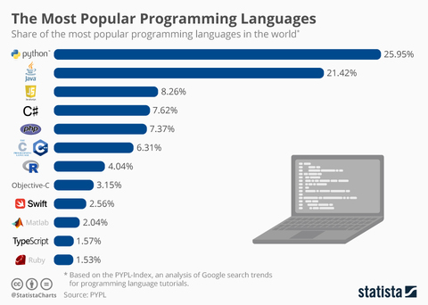
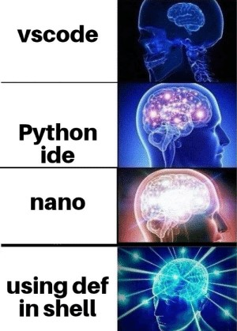
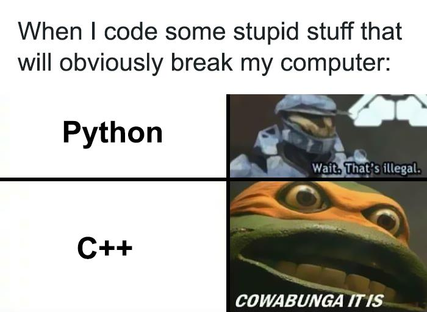

class: center, middle, inverse, small-images

# Python: Primeiros passos


---
class: inverse

# Temas

1. Programação - O que é?
2. Programar em Python
3. Hello World - O Primeiro Programa
4. Variáveis

---
class: image-spaced

# Programação - O que é?
**Linguagens de Alto Nível** - Linguagens de Programação, como Java, C++ ou Python, que precisam de ser traduzidas para algo que o computador consiga executar.


---

**Linguagens Compiladas** - Linguagem que, após compilada, gera machine code (código-máquina) - C++, C, C#...

**Linguagens Interpretadas** - Linguagens em que o código, ao invés de ser compilado, é lido e executado por um programa - Python, JavaScript, BASIC...
<br/><br/><br/>


---
class: small-images, image-spaced

# Programar em Python
- **Replit**: https://replit.com/
- GDB: https://www.onlinegdb.com/
- Python 3.10 (Shell): https://www.python.org/downloads/release/python-3100/
- **VS Code**: https://code.visualstudio.com/
- **Pycharm**: https://www.jetbrains.com/pycharm/
- **Spyder/Anaconda**: https://www.anaconda.com/

---
class: center, middle


---
# Programar em Python
## The Zen of Python
- Beautiful is better than ugly
- Explicit is better than implicit
- Simple is better than complex
- Complex is better than complicated
- Readability counts
- ...(it goes on but you get the point)

---
class: center, middle


---

# Hello World!
O programa "Hello World" é o típico primeiro programa que todos os iniciantes fazem numa qualquer nova linguagem de programação; em Python, este programa destaca-se pela sua simplicidade (o mesmo programa em C++ abaixo, **apenas** para efeitos de comparação):

```python
# O teu primeiro programa em Python! :)

print("Hello World!")
```
```cpp
// Não tentem isto em casa
#include <iostream>

using namespace std;

int main()
{
    cout<<"Hello World";

    return 0;
}
```

---
class: center, middle, inverse
# Variáveis

---
# Variáveis

De modo a simplicar a visão de uma variável pode-se equipará-la a uma caixa à qual é atribuída um valor, ou seja, o conteúdo que se encontra dentro da caixa.


---

# Variáveis

Há 6 tipos de variáveis nativos de python (i.e, não necessitamos de ferramentas adicionais para trabalhar com as mesmas):
- Números (ints e floats) (ex: **4** e **3.14159**, respetivamente)
- Booleanos (Verdadeiro ou Falso) (ex: **True** e **False**, respetivamente)
- Strings (Cadeias de caracteres) (ex: **"O curso é bom (juro)"**) <-- **Não mutáveis!!**
- Listas (ex: **["a", -3, True]**) 
- Dicionários (ex: **{"jogo": "Undertale", "score": 9}**)
- Tuplos (ex: **(2,3)**) <-- **Não mutáveis!!**

Há que mencionar que se pode mudar o valor de uma dada variável com o valor de p.ex **2** para o valor **"João"** em qualquer parte do código, visto que não se atribui nenhum tipo específico às variáveis em python (ao contrário de p.ex C++).

---
# Operações com listas

Ao contrário de variáveis como tuplos e strings, podem-se mudar os valores de uma lista, sejam eles quais foram. Um exemplo disso seria:

```python
list1 = [1,2,3,4]
list1[2] = 5    # Altera o 3º elemento de list1 de 3 para 5
list1[0] = 2    # Qual é o valor que é mudado?
list1[-1] = 9   # Altera o último valor de list1

```

Para além disto, também temos diversos outros métodos que mexem com listas:
- **.append(x)** - adiciona um valor ao final da lista
- **.insert(x, y)** - insere o valor **y** no índice **x**
- **.remove(x)** - remove a primeira ocorrência de **x** na lista
- **.pop(y)** - remove o elemento da lista no índice **y** e retorna esse valor

---
class: center, middle, inverse
# Operações aritméticas

---
class: medium-images
# Operações aritméticas
Em python, existem 7 principais operações numéricas que se podem realizar:

- **+** (soma)
- **-** (subtração)
- **\*** (multiplicação)
- **/** (divisão)
- **\*\*** (expoente)
- **//** (divisão inteira)
- **%** (resto)

Uma divisão não inteira entre p.ex **3** e **2** vai dar naturalmente um número em **float** (1.5 no caso), o que não acontece em outras linguagens como C++.
---
class: center, middle


---
class: center, middle, inverse
# Condições

---
# Condições

De modo a estabelecer comportamentos específicos do programa quando o mesmo cumpre certos requisitos, utiliza-se os **if** **else** *statements*. 
- **"if"**: se a condição proposta for verdadeira, executa o código deste bloco
- **"elif"**: ("else" + "if") se a(s) condição/condições proposta(s) anteriormente forem falsas e esta verdadeira, executa o código deste bloco
- **"else"**: caso nenhuma das condições anteriores seja verdade, executa este bloco

Para criar as condições usadas nestes blocos de código, podem-se usar alguns dos seguintes **operadores lógicos:**
- **">"** e **">="** (**maior que** e **maior ou igual a**)
- **"<"** e **"<="** (**menor que** e **menor ou igual a**)
- **"!="** e **"=="** (**diferente de** e **igual a**)
- **"and"** e **"or"** (**logic AND** e **logic OR**)
- **"not"** (**logic NOT**)


---
class: center, middle


---
class: center, middle, inverse
# Ciclos
---

# Ciclos
Sempre que se quer repetir um conjunto de instruções dada uma certa condição, pode-se dar uso aos ciclos **while**. <br>
Nas situações em que seja necessário repetir uma parte de código n vezes ou aplicá-lo em n elementos, usam-se os ciclos **for**.

```python
for num in range(10):
    # Executa algo 10 vezes

for num in range(1, 5):
    # Executa algo 4 (5-1) vezes

for num in range(1, 5, 2):
    # Executa algo 2 vezes (quando num == 1 e num == 1+2)

while(num<10):
    # Executa algo enquanto a variável num for inferior a 10
```
Se se quiser sair de um loop a uma dada altura, basta declarar um **break** enquanto que, para ignorar uma dada etapa do loop, pode-se utilizar o **continue**.

---
class: center, middle, inverse
# Funções
---
# Funções
As funções em Python têm como pincipal papel facilitar uma melhor organização, tornando o código mais "reciclável".

```python
def amongus(int x):         # Verifica se um número x é par
    return (x % 2 == 0)

for num in range(11):
    if amongus(num): print(num) # imprime todos os números pares de 1 a 10 
    else: continue

```

Como se pode observar, basta criar a função, chamá-la e o código que se encontra na mesma será executado.

---
class: center, middle


---
class: center, middle, inverse, medium-images
# Fim!
